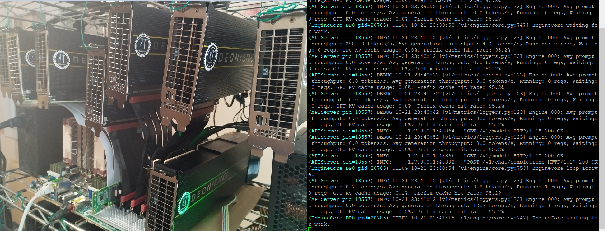

# Guidances for Test setup of 8 AMD MI50 32GB (LLM)



**Goal: reach production ready system for autonomous software development at minimal cost & maximal throughput+accuracy**

**GPUs cost**: 880$ for 256GB VRAM

**Power draw**: 280W (idle) / 1200W (inference)

**Feel free to ask any questions and/or share any comments in the issues section here or in the medium article:** 
https://medium.com/@ai-infos/8x-amd-mi50-32gb-at-12-t-s-tg-10k-t-s-pp-with-glm-4-6-roo-code-vllm-gfx906-ed2da2f237db


## Hardware details

- 8x AMD MI50 32GB
- Motherboard with 7 PCIe 4.0 ports x16
- AMD EPYC CPU with 128 lanes (48 cores 2.3 GHz)
- 1x 64 GB ram DDR4 3200 ECC
- 2x PSU 1600W (with 1 add2psu)
- 5x LINKUP Ultra PCIe 4.0 x16 Risers
- 2x SlimSAS PCIe device adapters
- 2x SlimSAS cables 8i
- 1x SlimSAS PCIe host adapter
- 1 NVME drive

## Software details

- Ubuntu v24.04
- ROCM v6.3.4
- torch v2.8
- triton-gfx906 v3.4
- vllm-gfx906 v0.11.0
- MI50 bios: 32G_UEFI.rom  
- upp for overclocking with relevant tables of V420.rom (1800/1100 SCLK/MCLK @300W) (https://gist.github.com/evilJazz/14a4c82a67f2c52a6bb5f9cea02f5e13) [+8% token generation boost]
- Fused moe config: E=20,N=1536,device_name=AMD_Instinct_MI50_MI60,dtype=int4_w4a16.json added in {your_python_env}/vllm/model_executor/layers/fused_moe/configs (source: https://github.com/nlzy/vllm-gfx906/pull/39/files) [+18% token generation boost]
- Visual Studio code with relevant extensions:
-- CodeRabbit (for code review)
-- Roo Code with relevant MCP servers (Context7, sequentialthinking, tavily for websearch)

## Relevant commands to run


### ROCm & amdgpu drivers

```code
# Get the script that adds the AMD repo for 24.04 (noble)
wget https://repo.radeon.com/amdgpu-install/6.3.4/ubuntu/noble/amdgpu-install_6.3.60304-1_all.deb
sudo apt install ./amdgpu-install_6.3.60304-1_all.deb

# Install ROCm  6.3.4 including hip, rocblas, amdgpu-dkms etc (assuming the machine has already the advised compatible kernel 6.11)
sudo amdgpu-install --usecase=rocm --rocmrelease=6.3.4    

sudo usermod -aG render,video $USER

# Verify ROCm installation
rocm-smi --showproductname --showdriverversion
rocminfo


# Add iommu=pt if you later grow beyond two GPUs
# ROCm’s NCCL-/RCCL-based frameworks can hang on multi-GPU rigs unless the IOMMU is put in pass-through mode
# see https://rocm.docs.amd.com/projects/install-on-linux/en/docs-6.3.3/reference/install-faq.html#multi-gpu

sudo sed -i 's/GRUB_CMDLINE_LINUX_DEFAULT="/GRUB_CMDLINE_LINUX_DEFAULT="iommu=pt /' /etc/default/grub
sudo update-grub
sudo reboot
cat /proc/cmdline  # >>> to check: must return: "BOOT_IMAGE=... iommu=pt"

```

### vllm-gfx906 fork with its dependencies (torch, triton, python, etc)

```code

pyenv install 3.12.11
pyenv virtualenv 3.12.11 venv312b
pyenv activate venv312b

# TRITON

git clone --branch v3.4.0+gfx906 https://github.com/nlzy/triton-gfx906.git
cd triton-gfx906
pip install 'torch==2.8' torchvision torchaudio --index-url https://download.pytorch.org/whl/rocm6.3  
pip install ninja 'cmake<4' wheel pybind11
pip wheel --no-build-isolation -v -w dist . 2>&1 | tee build.log
pip install ./dist/triton-*.whl  


# VLLM

git clone --branch v0.11.0+gfx906 --single-branch https://github.com/nlzy/vllm-gfx906.git
cd vllm-gfx906
pip install 'jinja2>=3.1.6' 'amdsmi>=6.2.4,<6.4'
pip install -r requirements/rocm.txt
pip wheel --no-build-isolation -v -w dist . 2>&1 | tee build.log
pip install ./dist/vllm-*.whl

```

### Download GLM 4.6 AWQ (4-bit)

```code
mkdir -p ~/llm/models/GLM-4.6-AWQ && cd ~/llm/models
pip install -U "huggingface_hub[cli]"
huggingface-cli download bullpoint/GLM-4.6-AWQ --local-dir ./GLM-4.6-AWQ
```

### Run GLM 4.6 in vllm-gfx906

```code
NCCL_P2P_DISABLE=1 VLLM_LOGGING_LEVEL=DEBUG VLLM_USE_TRITON_FLASH_ATTN=1 NCCL_DEBUG=INFO vllm serve \
  ~/llm/models/GLM-4.6-AWQ --gpu-memory-utilization 0.98 \
  --served-model-name GLM-4.6-AWQ-4bit \
  --dtype float16 --tensor-parallel-size 4 --pipeline-parallel-size 2 --tool-call-parser glm45 --reasoning-parser glm45 \
  --enable-auto-tool-choice --max-model-len 131072 --swap-space 0 2>&1 | tee log.txt

# NB1: running without --enable-expert-parallel is faster (token generation speed +40% and same prompt processing speed but slower weights init load) for this model (and most current models out there, except Deepseek).
# NB2: running with --tensor-parallel-size 8 can be faster here but not working with this quant model due to quantization group size & block_size_k = 128 raising issue: size_k (= moe_intermediate_size / tp_size = 1536 / 8 = 192) not divisible by block_size_k
```

**Enjoy your most cost effective solution of the world for one of the best fast intelligent local inference setup (at the moment).**

## TODO LIST

- improve this guidance draft (content/form)
- add upp overclocking details (with big disclaimer: only for users knowing what they do due to card damage risks)
- add docker files for easy setup
- open source the test setup of 16 AMD MI50 32GB for Deepseek 671B powered by solar panels system

**Credits: Global Open source Community**
